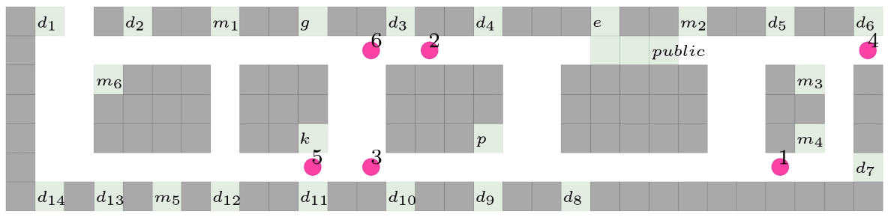

# Simultaneous Task Allocation and Planning for Multi-Robots under Hierarchical Temporal Logic Specifications
Research in robotic planning with temporal logic specifications, such as Linear Temporal Logic (LTL), has relied on single formulas. However, as task complexity increases, LTL formulas become lengthy, making them difficult to interpret and generate, and straining the computational capacities of planners. To address this, we introduce a hierarchical structure for a widely used specification type—LTL on finite traces. The resulting language, termed H-LTL_f, is defined with both its syntax and semantics. We further prove that H-LTL_f is more expressive than its standard “flat” counterparts. Moreover, we conducted a user study that compared the standard LTL_f with our hierarchical version and found that users could more easily comprehend complex tasks using the hierarchical structure. We develop a search-based approach to synthesize plans for multi-robot systems, achieving simultaneous task allocation and planning. This method approximates the search space by loosely interconnected sub-spaces, each corresponding to an LTL_f specification. The search primarily focuses on a single sub-space, transitioning to another under conditions determined by the decomposition of automata. We develop multiple heuristics to significantly expedite the search. Our theoretical analysis, conducted under mild assumptions, addresses completeness and optimality. Compared to existing methods used in various simulators for service tasks, our approach improves planning times while maintaining comparable solution quality.


# Install
 The code is tesed using Python 3.10.12.
### Develop via Conda
 Following the instruction:
```bash
cd /path/to/Hierarchical-LTL-Stap
conda env create -f environment.yml
conda activate hierarchical_ltl_stap
```
### Import as package
```bash
cd /path/to/Hierarchical-LTL-Stap
pip install -e .
```
### Install ltl2ba
Download the software `LTL2BA` from this [link](http://www.lsv.fr/~gastin/ltl2ba/index.php), and follow the instructions to generate the exectuable `ltl2ba` and then copy it into the folder `Hierarchical-LTL-Stap`, same hierarchy level with `hierarchical_LTL_stap_on_the_fly.py`.
# Usage
## Input
* Folder [domain](./domain) includes domain files that describe robot and environment action models.
* Scripts [workspace](./hierarchical_ltl_stap/workspace_bosch.py) describes the environment that robots reside in.
* Script [specification.py](./hierarchical_ltl_stap/specification.py) includes hierarchical task specifications.
# Simulation
The simulation environment and tasks are inspired by [Schillinger et al.](https://journals.sagepub.com/doi/abs/10.1177/0278364918774135)
### Environment 



The office building is depicted using a grid-based layout, where areas $d_1$ to $d_{14}$ represent desks, $m_1$ to $m_6$ are meeting rooms, $e$ stands for the elevator, $g$ for the garbage room, $p$ for the printer room, and $k$ for the coffee kitchen. Areas marked as "public" indicate public spaces. Obstacles are illustrated in gray. The locations of robots are shown as numbered red dots.
### Scenario 1 
Empty a paper bin located at desk $d_5$. During this task, the robot must avoid the public area while transporting the bin.

$$
\begin{align*}
 L_1: \quad &  \phi(1,1) =  \Diamond \phi(2,1) \wedge \Diamond\phi(2,2)\\
 L_2: \quad &  \phi(2,1) = \Diamond (d_5 \wedge \mathsf{default} \bigcirc ((\mathsf{carrybin}\  \mathcal{U}\  \mathsf{dispose}) \wedge \Diamond \mathsf{default})) \wedge \square (\mathsf{carrybin \Rightarrow \neg \mathsf{public}})\\
                & \phi(2,2) = \Diamond (g \wedge \bigcirc (g \wedge \mathsf{emptybin}) \wedge \Diamond (d_5 \wedge \bigcirc (d_5 \wedge \mathsf{default})))
\end{align*}
$$

```bash
python hierarchical_LTL_stap_on_the_fly.py --task=nav --case=12 --heuristics --heuristic_weight=100 --domain_file=./domain/domain_bosch.json --cost=min --domain=bosch --num_robots=6 --vis --print_step 
```
The explanation of arguments can be found in function [create_parser](hierarchical_ltl_stap/util.py).
<video src="https://github.com/user-attachments/assets/bed12153-de0d-4153-bbaf-6717ad5f2868" controls="controls" style="max-width: 730px; width: 100%; height: auto;">
</video>

```bash
python hierarchical_LTL_stap_on_the_fly.py --task=nav --case=12 --heuristics --heuristic_weight=100 --domain_file=./domain/domain_bosch.json --cost=minmax --domain=bosch --num_robots=6 --vis --print_step 
```
<video src="https://github.com/user-attachments/assets/879d2485-acb8-4ec1-ab0c-74225fd1241a" controls="controls" style="max-width: 730px; width: 100%; height: auto;">
</video>

### Scenario 2
Distribute printed copies of a document to desks $d_{10}$, $d_7$, and $d_5$, and avoid public areas while carrying the document. 

$$
\begin{align*}
L_1: \quad &  \phi(1,1) =  \Diamond\phi(2,1) \wedge \Diamond\phi(2,2) \wedge \Diamond\phi(2,3)\\
 L_2: \quad &  \phi(2,1) = \Diamond (p \wedge \mathsf{carry}\  \mathcal{U}\  (d_{10} \wedge \bigcirc \neg \mathsf{carry})) \wedge \square (\mathsf{carry} \Rightarrow \neg \mathsf{public})  \\
 &  \phi(2,2) = \Diamond (p \wedge \mathsf{carry}\  \mathcal{U}\  (d_{7} \wedge \bigcirc \neg \mathsf{carry})) \wedge \square (\mathsf{carry} \Rightarrow \neg \mathsf{public})  \\
 &  \phi(2,3) = \Diamond (p \wedge \mathsf{carry}\  \mathcal{U}\  (d_{5} \wedge \bigcirc \neg \mathsf{carry})) \wedge \square (\mathsf{carry} \Rightarrow \neg \mathsf{public})  
\end{align*}
$$
```bash
python hierarchical_LTL_stap_on_the_fly.py --task=nav --case=13 --heuristics --heuristic_weight=100 --domain_file=./domain/domain_bosch.json  --domain=bosch --num_robots=6 --vis --print_step 
```
<video src="https://github.com/user-attachments/assets/58236e50-5649-4185-b006-39f22f2da01e" controls="controls" style="max-width: 730px; width: 100%; height: auto;">
</video>


### Scenario 3
Take a photo in meeting rooms $m_1$, $m_4$, and $m_6$. The camera should be turned off for privacy reasons when not in meeting rooms. Deliver a document from desk $d_5$ to $d_3$, ensuring it does not pass through any public areas, as the document is internal and confidential. Guide a person waiting at desk $d_{11}$ to meeting room $m_6$.

$$
\begin{align*}
 L_1: \quad &  \phi(1,1) =  \Diamond\phi(2,1) \wedge \Diamond \phi(2,2) \wedge  \Diamond \phi(2,3)\\
 L_2: \quad &  \phi(2,1) = \Diamond \phi(3,1)\wedge \Diamond \phi(3,2)\wedge \Diamond \phi(3,3)\\
  &  \phi(2,2) = \Diamond (d_5 \wedge \mathsf{carry} \  \mathcal{U} \  (d_3 \wedge \bigcirc \neg \mathsf{carry})) \wedge \square (\mathsf{carry} \Rightarrow \neg \mathsf{public}) \\
  &  \phi(2,3) = \Diamond (d_{11}\wedge \mathsf{guide} \  \mathcal{U}\  (m_6 \wedge \bigcirc \neg \mathsf{guide})) \\
 L_3: \quad &  \phi(3,1) = \Diamond(m_1 \wedge \mathsf{photo}) \wedge \square (\neg \mathsf{meeting} \Rightarrow \neg \mathsf{camera} ) \\
 &  \phi(3,2) = \Diamond(m_4 \wedge \mathsf{photo})\wedge \square (\neg \mathsf{meeting} \Rightarrow \neg \mathsf{camera} ) \\
 &  \phi(3,3) = \Diamond(m_6 \wedge \mathsf{photo}) \wedge \square (\neg \mathsf{meeting} \Rightarrow \neg \mathsf{camera} ) \\
 & \mathsf{meeting} := \  m_1 \vee  m_2 \vee  m_3 \vee  m_4 \vee  m_5 \vee  m_6 
% \end{empheq}
\end{align*}
$$
```bash
python hierarchical_LTL_stap_on_the_fly.py --task=nav --case=14 --heuristics --heuristic_weight=100 --domain_file=./domain/domain_bosch.json  --domain=bosch --num_robots=6 --vis --print_step 
```
<video src="https://github.com/user-attachments/assets/41b4e1c8-5ac5-43ba-ab2e-04d490721bb4" controls="controls" style="max-width: 730px; width: 100%; height: auto;">
</video>

### Scenario 4 
Combinations of scenarios 1, 2 and 3

$$
\begin{align*}
 L_1: \quad &  \phi(1,1) =  \Diamond \phi(2,1) \wedge \Diamond\phi(2,2)  \wedge \Diamond\phi(2,3)\\
 L_2: \quad &  {\phi(2,1) =  \Diamond \phi(3,1) \wedge \Diamond\phi(3,2)} \\
            &  {\phi(2,2) =  \Diamond\phi(3,3) \wedge \Diamond\phi(3,4) \wedge \Diamond\phi(3,5)}\\
            &  {\phi(2,3) =  \Diamond\phi(3, 6) \wedge \Diamond\phi(3, 7) \wedge \Diamond\phi(3, 8)}\\
 L_3: \quad &  {\phi(3,1) = \Diamond (d_5 \wedge \mathsf{default}} {\wedge \bigcirc ((\mathsf{carrybin}\  \mathcal{U}\  \mathsf{dispose}) \wedge \Diamond \mathsf{default}))} \wedge \square (\mathsf{carrybin \Rightarrow \neg \mathsf{public}})\\
                & {\phi(3,2) = \Diamond (d_5 \wedge \mathsf{emptybin} \wedge \bigcirc (d_5 \wedge \mathsf{default}))} \\
 & {\phi(3,3) = \Diamond (p \wedge \mathsf{carry}\  \mathcal{U}\  (d_{10} \wedge \bigcirc \neg \mathsf{carry}))} \wedge \square (\mathsf{carry} \Rightarrow \neg \mathsf{public}) \\
 &  {\phi(3,4) = \Diamond (p \wedge \mathsf{carry}\  \mathcal{U}\  (d_{7} \wedge \bigcirc \neg \mathsf{carry}))} \wedge \square (\mathsf{carry} \Rightarrow \neg \mathsf{public})  \\
 &  {\phi(3,5) = \Diamond (p \wedge \mathsf{carry}\  \mathcal{U}\  (d_{5} \wedge \bigcirc \neg \mathsf{carry}))} \wedge \square (\mathsf{carry} \Rightarrow \neg \mathsf{public})  \\ 
                & {\phi(3, 6) = \Diamond  \phi(4, 1) \wedge \Diamond  \phi(4, 2) \wedge \Diamond  \phi(4, 3)} \\
                  & { \phi(3, 7) = \Diamond (d_5 \wedge \mathsf{carry} \  \mathcal{U} \  (d_3 \wedge \bigcirc \neg \mathsf{carry}))} \wedge \square (\mathsf{carry} \Rightarrow \neg \mathsf{public}) \\
  &  {\phi(3, 8) = \Diamond (d_{11}\wedge \mathsf{guide} \  \mathcal{U}\  (m_6 \wedge \bigcirc \neg \mathsf{guide}))} \\
 L_4: \quad &  {\phi(4, 1) = \Diamond(m_1 \wedge \mathsf{photo}) \wedge \square (\neg \mathsf{meeting} \Rightarrow \neg \mathsf{camera} )} \\
 &  {\phi(4, 2) = \Diamond(m_4 \wedge \mathsf{photo})\wedge \square (\neg \mathsf{meeting} \Rightarrow \neg \mathsf{camera} )} \\
 &  {\phi(4, 3) = \Diamond(m_6 \wedge \mathsf{photo}) \wedge \square (\neg \mathsf{meeting} \Rightarrow \neg \mathsf{camera} )} \\
 & {\mathsf{meeting} := \  m_1 \vee  m_2 \vee  m_3 \vee  m_4 \vee  m_5 \vee  m_6   }
 \end{align*}
 $$
 ```bash
python hierarchical_LTL_stap_on_the_fly.py --task=nav --case=21 --heuristics --heuristic_weight=100 --domain_file=./domain/domain_bosch.json  --domain=bosch --num_robots=6 --vis --print_step 
```
<video src="https://github.com/user-attachments/assets/d65a0b99-b74e-4095-a2b8-0fad1b47919a" controls="controls" style="max-width: 730px; width: 100%; height: auto;">
</video>

## Simulaiton in AI2THOR

<video src="https://github.com/user-attachments/assets/d52152d0-2622-4db9-a8fc-1ba5a882ae21" controls="controls" style="max-width: 730px; width: 100%; height: auto;">
</video>

# Citation
```
@article{luo2025simultaneous,
  title={Simultaneous Task Allocation and Planning for Multi-Robots under Hierarchical Temporal Logic Specifications},
  author={Luo, Xusheng and Liu, Changliu},
  journal={IEEE Transaction on Robotics},
  year={2025},
  publisher={IEEE}
}
```

# Related work
```
@article{luo2024decomposition,
  title={Decomposition-based hierarchical task allocation and planning for multi-robots under hierarchical temporal logic specifications},
  author={Luo, Xusheng and Xu, Shaojun and Liu, Ruixuan and Liu, Changliu},
  journal={IEEE Robotics and Automation Letters},
  year={2024},
  publisher={IEEE}
}
@inproceedings{wei2025hierarchical,
  title={Hierarchical Temporal Logic Task and Motion Planning for Multi-Robot Systems},
  author={Wei, Zhongqi and Luo, Xusheng and Liu, Changliu},
  booktitle={Robotics: Science and Systems},
  year={2025}
}
```
